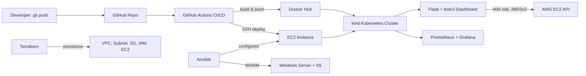

# AWS Infra Health Dashboard — End-to-End DevOps Pipeline

A containerized web dashboard showing **live EC2 instance health**, deployed through a full DevOps pipeline: Terraform → Docker → GitHub Actions CI/CD → Kubernetes → Ansible (including a Windows target) → Prometheus/Grafana monitoring.

Built as my hands-on portfolio project transitioning from a 2+ year AWS/VMware Windows administrator role into DevOps.

## Why this project

Most portfolio projects deploy a to-do app. I wanted mine to reflect real infrastructure work — the kind I used to do manually as an admin — now automated, containerized, and observable end to end.

## Architecture



## What it does

- Live dashboard (`/`) and JSON API (`/api/instances`) showing EC2 instance state, type, AZ, and uptime
- `/health` endpoint for orchestration/liveness checks
- Authenticates to AWS via an **IAM role**, not hardcoded credentials

## Tech stack

| Layer | Tool |
|---|---|
| App | Python, Flask, boto3 |
| Containerization | Docker |
| IaC | Terraform (VPC, IAM, EC2, security groups) |
| CI/CD | GitHub Actions |
| Orchestration | Kubernetes (`kind`) |
| Config management | Ansible (Linux + **Windows via WinRM**) |
| Monitoring | Prometheus, Grafana (via Helm) |
| Registry | Docker Hub |

## Screenshots

- Dashboard view
- `kubectl get pods` showing running replicas
- GitHub Actions pipeline succeeding
- Grafana dashboard with live metrics
- Windows IIS page served after Ansible configuration

## Challenges I hit and how I solved them

This is the section I'm proudest of — real problems, not a copy-pasted tutorial:

- **AMI naming changes across Ubuntu versions**: Terraform's AMI lookup failed silently across 22.04/24.04/26.04 due to changing name patterns (`hvm-ssd` vs `hvm-ssd-gp3`, codename changes) — learned to verify AMI filters directly rather than trust stale examples.
- **Free-tier instance type varies by region**: `t2.micro` isn't free-tier eligible in every region; confirmed the correct type per-region via `aws ec2 describe-instance-types` instead of assuming.
- **State drift from running Terraform on two machines**: caused duplicate resources and an `EntityAlreadyExists` error on an IAM role. Fixed by destroying duplicates and standardizing on a single machine as the Terraform "control point" — a real lesson in why teams use remote state backends.
- **`NoCredentialsError` inside Kubernetes pods**: `kind`'s nested container networking blocked access to the EC2 instance metadata service. Root-caused it to IMDSv2's default hop limit, fixed by raising `http-put-response-hop-limit`, and made the fix permanent via Terraform's `metadata_options` block.
- **GitHub Actions SSH deploy timing out**: GitHub-hosted runners use dynamic IPs, which a security group locked to "my IP" blocks by design. Resolved by scoping SSH access appropriately for CI while understanding the security trade-off involved.
- **Memory/disk exhaustion on `t3.micro`**: hit OOM issues running `kind` + the app together; added swap, then right-sized up to `t3.small` for the Kubernetes phase.

## Running it locally

```bash
docker pull ylayareddy/infra-health-dashboard:latest
docker run -d -p 5000:5000 ylayareddy/infra-health-dashboard:latest
```
Requires an IAM role with `AmazonEC2ReadOnlyAccess` attached to the host.

## Repo structure

.
├── app.py, requirements.txt, Dockerfile # the application
├── terraform/ # infra as code
├── k8s/ # Kubernetes manifests
├── ansible/ # config management (Linux + Windows)
└── .github/workflows/ci-cd.yml # CI/CD pipeline


## Author

**Laya Reddy** — AWS/VMware Windows administrator transitioning into DevOps.
[LinkedIn](www.linkedin.com/in/laya-r-172b32403) | [GitHub](https://github.com/layareddy10-source) | [Portfolio](https://github.com/layareddy10-source/layareddy10-source.github.io/)
